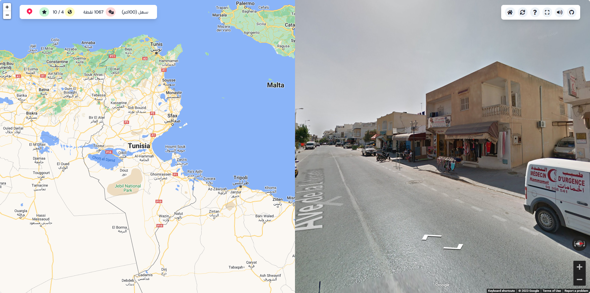
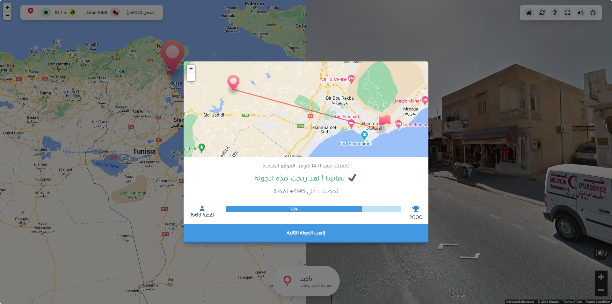
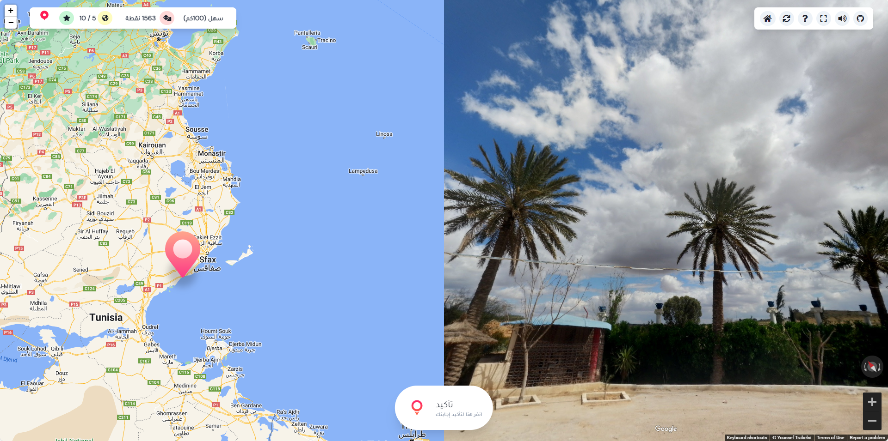
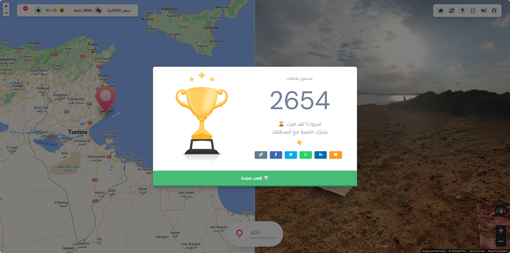
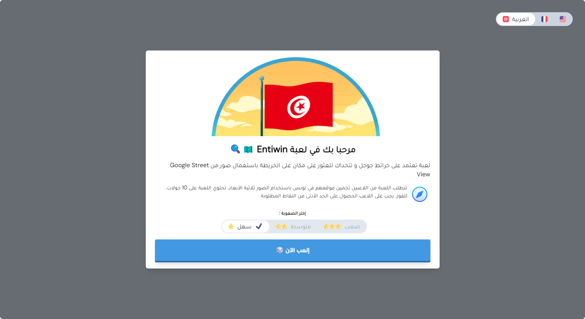

<p align="center">
  
  <h1 align="center">Entiwin</h1>
  <h4 align="center">GeoGuessr-like game (Tunisian version) 🇹🇳 </h4>
</p>

EntiWin is an online game based on Google Maps that challenges you to find a place on a map from the images taken by Google Street View.

The game is based on Google Maps / Google Street View. The game requires players to guess their location in Tunisia using only the clues visible. The game has 10 rounds. To win, the player must obtain the minimum number of points required

## Important

```
📢 This project is old (2018)
TailwindCSS was a new thing back then. I was learning it and I wanted to try it in a real project. So, I made this game. I'm not proud of the code, but I'm proud of the idea. If you want to contribute, you're welcome. I'm not working on this project anymore.
```

## Website

[https://entiwin.surge.sh/](https://entiwin.surge.sh/)


## Screenshots












## Built With

- [Angular](https://angular.io/)
- [TailwindCSS](https://tailwindcss.com/)

## Authors

[Adem KOUKI](https://ademkouki.tech/)

## License

MIT

## FAQ

Q: Is it the same as Geoguessr?

A: No, it's not. Geoguessr is a great game, but it's not free (5 rounds per day). Entiwin is free and it's based on Tunisia. Same concept, different game.

Q: Why did you make this game?

A: I wanted to learn TailwindCSS and I wanted to make a game. 

Q: How can I contribute?

A: You can contribute by adding new places to the game / fixing bugs / adding new features / updating to newer versions of Angular and TailwindCSS. Feel free to open an issue or a pull request.